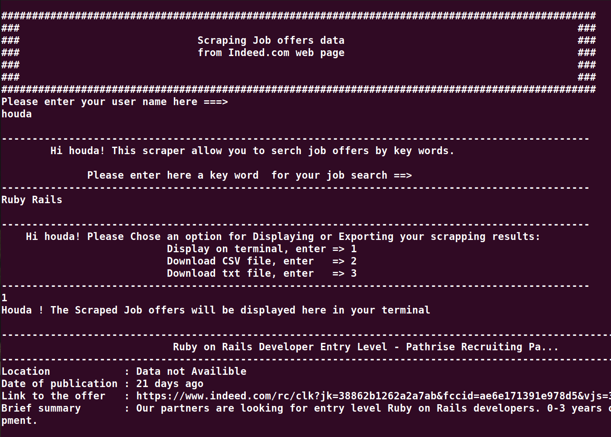

# Job offers Scraper
This is a web scraper for jobs offers web site <https://www.indeed.com> .

# About the project

* The program is implementing a scraper for search results of a Job offer website
* This scraper helps you to:
- - Search by key words in <https://www.indeed.com> web page
- - Scrape the results of the search
- - Display the scraped data in terminal or to export them into a CSV or a Text files

# Preview




## Built With

- Programming langage : Ruby
- Editor : VSCode
- Linter : Rubocop

## Code testing

- Tool : Rspec

## Learning objectives

* Implement basics of the Object Oriented Programming
* The use of Ruby's best practices
* Project organisation and Git workflow

## Project Structure
```
├── LICENCE
├── README.md
├── bin
│   └── main.rb
└── lib
    └── interface.rb
    └── output.rb
    └── page.rb
    └── scraper.rb
    └── url.rb
└── rspec
    └── interface_spec.rb
    └── page_spec.rb
    └── scraper_spec.rb
    └── url_spec.rb
    └── spec_helper.rb
```
## Get started

* Clone this repository to your local machine by runing these comand on your local terminal
```
git clone https://github.com/CalyCherkaoui/Web_Scraper_Ruby.git
cd Web_scraper_Ruby
git checkout scraper
code .

```
* Change directory to the project directory `` cd Web_Scraper_Ruby ``
* Install the gems by runing the command line `` bundle install ``
* In the terminal run `` ruby bin/main.rb ``
* If you chose to export the outputs , you will find the csv and txt files in the project repository

## Author

👤 **Houda Cherkaoui**

- Github: [@CalyCherkaoui](https://github.com/CalyCherkaoui)
- Twitter: [@Houda59579688](https://twitter.com/Houda59579688)
- Linkedin: [Houda-Cherkaoui](https://www.linkedin.com/in/houda-cherkaoui-64106395/)

## 🤝 Contributing

Contributions, issues and feature requests are welcome!

## Show your support

Give a ⭐️ if you like this project!

## Acknowledgments

- Hat tip to anyone whose code was used
- Inspiration
- Microverse

## 📝 License

This project is [MIT](lic.url) licensed.

